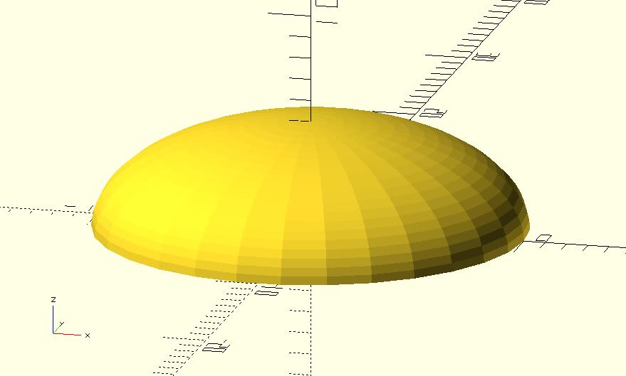
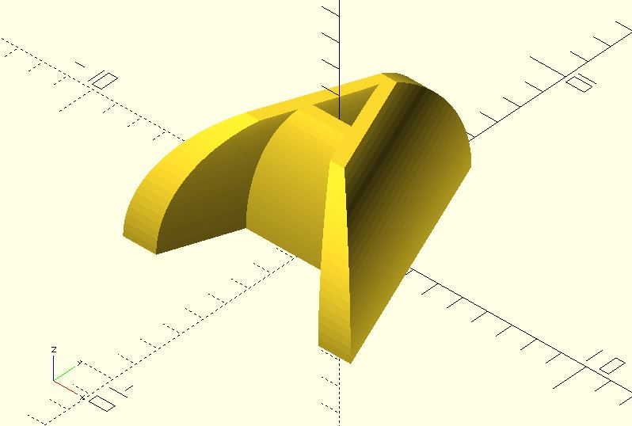
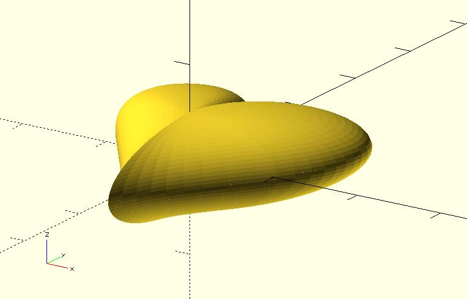
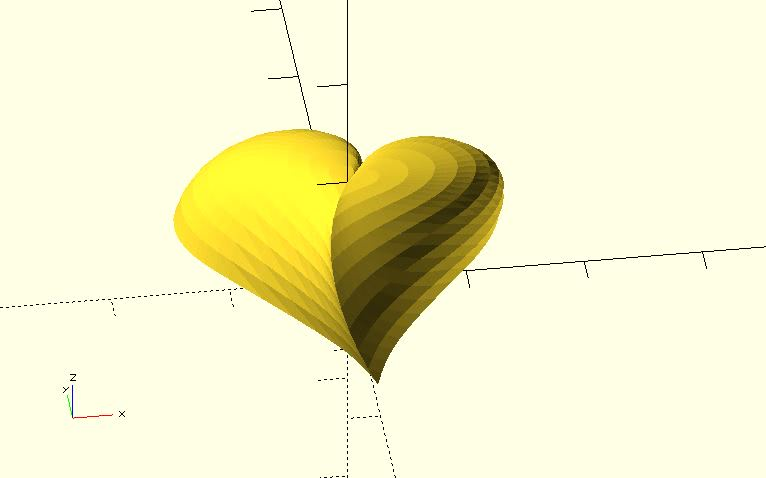

# ellipse_extrude

Extrudes a 2D object along the path of an ellipse from 0 to 180 degrees. The semi-major axis is not necessary because it's eliminated while calculating.

## Parameters

- `semi_minor_axis` : The semi-minor axis of the ellipse.
- `height` : The extruded height. It defaults to `semi_minor_axis` if ignored. The `height` should not greater than `semi_minor_axis`. If it's greater than `semi_minor_axis`, the module will use `semi_minor_axis`.
- `center`, `convexity`, `twist`, `slices`: The same as respective parameters of `linear_extrude`.

## Examples

	use <ellipse_extrude.scad>;
	
	semi_minor_axis = 5;
	 
	ellipse_extrude(semi_minor_axis) 
	    circle(semi_minor_axis * 2);

	use <ellipse_extrude.scad>;
	
	semi_minor_axis = 5;
	 
	ellipse_extrude(semi_minor_axis, height = 4.5) 
	    text("A", valign = "center", halign = "center");

    use <ellipse_extrude.scad>;

	semi_minor_axis = 5;
	 
	ellipse_extrude(semi_minor_axis) 
	    text("♥", size = 40, valign = "center", halign = "center");
	mirror([0, 0, 1]) ellipse_extrude(semi_minor_axis) 
	    text("♥", size = 40, valign = "center", halign = "center");

	use <ellipse_extrude.scad>;
	
	semi_minor_axis = 10;
	 
	ellipse_extrude(semi_minor_axis, twist = 30, slices = 10) 
	    text("♥", size = 40, valign = "center", halign = "center");

