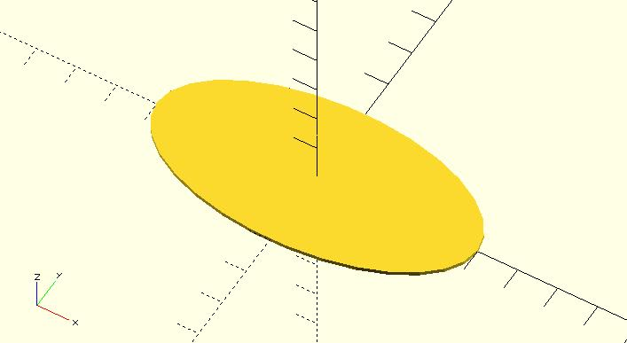
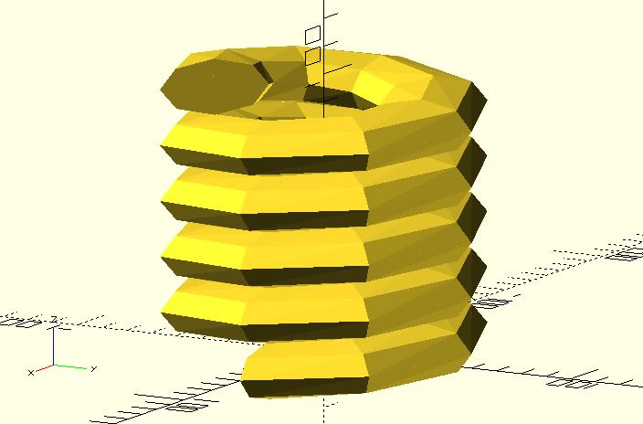

# shape_ellipse

Returns shape points of an ellipse. They can be used with xxx_extrude modules of dotSCAD. The shape points can be also used with the built-in polygon module. 

## Parameters

- `axes` : 2 element vector `[x, y]` where x is the semi-major axis and y is the semi-minor axis.
- `$fa`, `$fs`, `$fn` : The shape created by this function can be viewd as `resize([x, y]) circle(r = x)` (but not the real implementation inside the module) so you can use these global variables to control it. Check [the circle module](https://en.wikibooks.org/wiki/OpenSCAD_User_Manual/Using_the_2D_Subsystem#circle) for more details. 

## Examples

	use <shape_ellipse.scad>;

	polygon(
		shape_ellipse([40, 20])
	);

	use <shape_ellipse.scad>;
	use <helix_extrude.scad>;

	$fn = 8;
		
	shape_pts = shape_ellipse([20, 10]);

	helix_extrude(shape_pts, 
		radius = 40, 
		levels = 5, 
		level_dist = 20,
        rt_dir = "CLK"
	);

