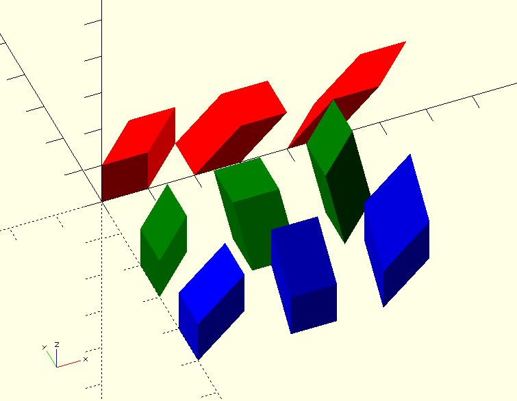

# shear

Shear all child elements along the X-axis, Y-axis, or Z-axis in 3D.

**Since:** 1.1

## Parameters

- `sx` : An array `[SHy, SHz]`. The new coordinates of child elements are `(x + SHy * y + SHz * z, y, z)`.
- `sy` : An array `[SHx, SHz]`. The new coordinates of child elements are `(x, y + SHx * x + SHz * z, z)`.
- `sz` : An array `[SHx, SHy]`. The new coordinates of child elements are `(x, y, z + SHx * x + SHy * y)`.

## Examples

	use <shear.scad>;

	color("red") {
		shear(sx = [1, 0])
			cube(1);
			
		translate([2, 0, 0]) shear(sx = [0, 1])
			cube(1);
			
		translate([4, 0, 0]) shear(sx = [1, 1])
			cube(1);
	}

	translate([0, -3, 0]) color("green") {
		shear(sy = [1, 0])
			cube(1);
			
		translate([2, 0, 0]) shear(sy = [0, 1])
			cube(1);
			
		translate([4, 0, 0]) shear(sy = [1, 1])
			cube(1);
	}

	translate([0, -5, 0]) color("blue") {
		shear(sz = [1, 0])
			cube(1);
			
		translate([2, 0, 0]) shear(sz = [0, 1])
			cube(1);
			
		translate([4, 0, 0]) shear(sz = [1, 1])
			cube(1);
	}

